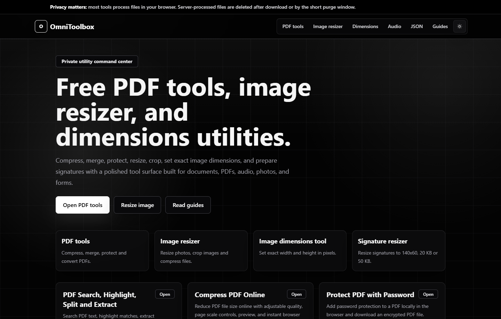

# OmniToolbox Frontend

OmniToolbox is a privacy-focused web utility suite for PDF and document tasks.
The frontend is built with Next.js and exposes PDF tools, image utilities,
guides, pricing, account pages and API-access documentation.



## Live Product

- Live URL: https://omnitoolbox.in
- Repository: https://github.com/Priyanshu61900/pdf-tools

## Features

- PDF search and highlight workflows
- Extract matching PDF pages
- PDF to Word conversion
- PDF compression, protection and related utility pages
- Authentication routes for email, Google and GitHub sign-in
- Free-plan limits with premium/API-ready request headers
- SEO pages, guides, sitemap, robots and legal pages
- API access page for developer usage

## Tech Stack

- Next.js
- React
- TypeScript
- Tailwind CSS
- FastAPI backend proxy routes
- Vercel deployment

## Local Setup

```bash
npm install
copy .env.example .env.local
npm run dev
```

Open `http://localhost:3000`.

## Environment Variables

```env
NEXT_PUBLIC_SITE_URL=https://omnitoolbox.in
GOOGLE_REDIRECT_URI=https://omnitoolbox.in/api/auth/google/callback
AUTH_SECRET=replace-with-a-long-random-secret
GOOGLE_CLIENT_ID=your-google-oauth-client-id
GOOGLE_CLIENT_SECRET=your-google-oauth-client-secret
GITHUB_CLIENT_ID=your-github-oauth-client-id
GITHUB_CLIENT_SECRET=your-github-oauth-client-secret
BACKEND_APP_SECRET=the-same-secret-set-on-render
RESEND_API_KEY=your-resend-api-key
AUTH_EMAIL_FROM=OmniToolbox <accounts@omnitoolbox.in>
```

Never commit `.env`, `.env.local`, OAuth secrets, app secrets or API keys.

## Scripts

```bash
npm run dev      # Start local development
npm run build    # Build production frontend
npm run start    # Start production build
npm run lint     # Run ESLint
```

## Interview Talking Points

- Productized a file-processing workflow instead of building a single demo page.
- Used focused tool routes so users can complete one document task quickly.
- Added public SEO content and legal pages for real deployment readiness.
- Kept sensitive backend processing behind server-side proxy routes and secrets.
- Designed the project so the same codebase can support free, premium and API users.
